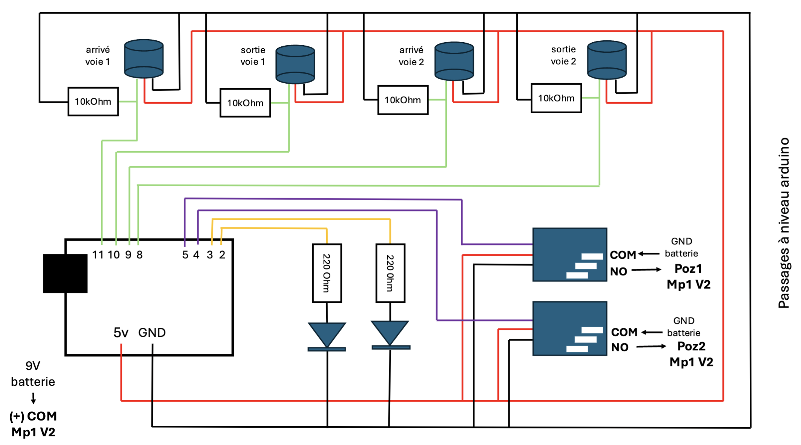

    _________
    |  _  |    __        PASSAGE A NIVEAU 
    | | | |____\/_     
    | |_| |       \      Automatisation d'un passage à niveau double voie
    | __  |  _  _  |        de modélisme feroviaire avec une arduino uno.
    |/  \_|_/ \/ \/   
     \__/   \_/\_/

## Materiel 

- 1 x [MP1 V2](www.mtb-model.com), pour actionner les barrieres
- 4 x capteurs de presence, 2 par voie: un en entrée et un en sortie
- 2 x module de relais Songle
- 2 x leds rouges, pour les feux de signalisation
- 2 x resistance 220 Ohm
- 4 x resistance 10k Ohm

## Circuit electrique

## Code 

Le code a besoin de la librarie [PinChangeInterrupt](https://github.com/NicoHood/PinChangeInterrupt) pour être notifié par les capteurs de présence.

Installation depuis le logiciel Arduino dans Outils > Gérer les bibliothèques > "PinChangeInt" > Installer.